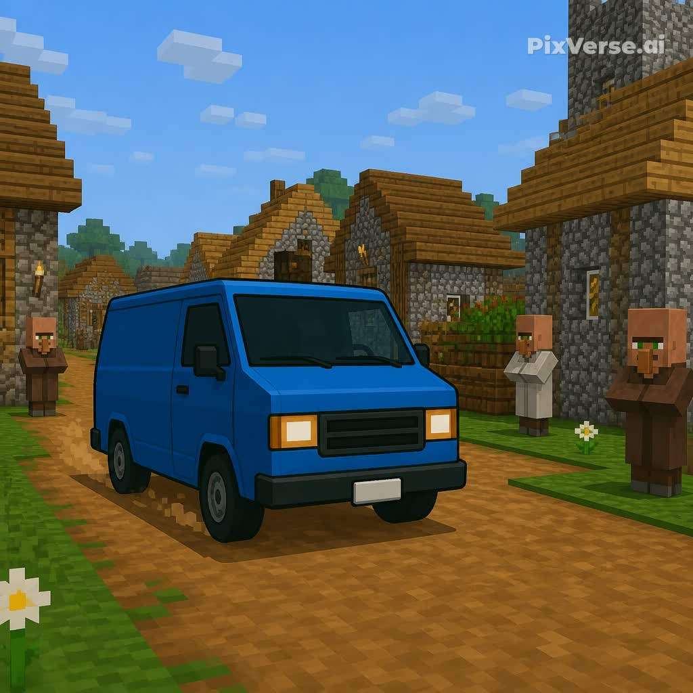

# Amazing™ — Earth's Blockiest Store

[](https://github.com/Ellosan/amazing-mod/actions/workflows/build.yml)

A Fabric mod for **Minecraft 1.21.1** that brings vehicles and *Amazing*, the
blocky online megastore, into your world. Order from a catalog of 130+
products, watch a real delivery van drive up to your base, and get your
package hand-delivered by an Amazing courier. Works in **singleplayer and
multiplayer** (client + server).



## What's new in 2.0

- 🏙️ **Amazing City world type** — select *Amazing City* when creating a world
  (or `level-type=amazing:city` on servers): infinite procedural city with
  roads, furnished houses, apartment towers, parks, street lamps, corner
  ATMs, and Amazing **warehouses stacked with packages** staffed by couriers
- 🧑‍🤝‍🧑 **Citizens** — custom-skinned NPCs (4 skins, generated names) who live in
  the city, chat when clicked, and receive deliveries
- 💵 **MineBank economy** — dollars replace emeralds: bank accounts, cash
  banknotes, **working ATMs** (withdraw/deposit/sell emeralds), e-banking,
  and player-to-player transfers
- ⭐ **Prime subscription** — $20 per 30 in-game days unlocks Prime
  Exclusives (gift cards redeem 30 days)
- 📱 **AmazingPhone X** — apps for Amazing (catalog + live order tracking),
  MineBank, GPS (coords, heading, waypoints), Quests, **internet Radio**
  (streams real Ogg Vorbis stations), and prank calls
- 🛋️ **Working furniture & tech** — sittable chairs, tables, togglable lamps,
  a TV that switches on, all placeable and sold in the catalog
- 🏎️ **Amazing Roadster** — a faster second vehicle
- 🐛 Fixed: quest packages can now actually be handed to villagers (the
  trade screen no longer eats the click)

## Features

### 🚚 Drivable vans
- Craft (or earn) your own **Amazing Van** and drive it with WASD
- Smooth boat-style client physics — responsive even on servers
- Animated spinning wheels, steering front wheels, exhaust smoke
- **Space** to brake, **H** to honk, punch it a few times to pack it up
- Seats two — bring a friend in the cargo bay

### 🛒 The Amazing catalog
- Press **O** (or use a **Prime Card**, or `/amazing shop`) to browse
- **130+ products** across 8 departments: Tools & DIY, Combat & Outdoors,
  Grocery, Home & Building, Amazing Basics Tech, Garden & Pets,
  Health & Alchemy, and Prime Exclusives
- Pay in MineBank dollars; shift-click **Buy** for a 4-pack
- **Prime Exclusives** (elytra, totems, shulker boxes, your own van…)
  require an active Prime subscription

### 📦 Real deliveries
- Orders dispatch an autonomous **delivery van** that drives to you
- An **Amazing courier** hops out, walks the package to your door, and
  hands it over — then jogs back and the van drives off
- Unbox packages with a right-click (item fountain included)
- Villagers get **ambient NPC deliveries** too — watch the vans do their
  rounds through your village
- Track everything with `/amazing orders`

### 🗺️ Quests
- Talk to any Amazing courier to get work:
  - **Courier runs** — hand-deliver a package to a villager
  - **Supply runs** — restock the warehouse
  - **Express reviews** — order something and receive it
- Dollar rewards paid straight to your account, plus milestones: a free **Prime Card** after 3 quests
  and your **own van** after 6
- `/amazing quest` to check, `/amazing quest abandon` to give up

### 🖥️ Revamped title screen
- Full **Amazing-themed main menu**: sunny sky, drifting clouds, and a
  delivery van doing laps across the road
- Rotating marketing splashes ("Now delivering to the Nether\*")
- A **Classic Menu** button if you miss vanilla

## Commands

| Command | What it does |
|---|---|
| `/amazing` | Help |
| `/amazing shop` | Open the catalog |
| `/amazing orders` | Track pending deliveries |
| `/amazing quest` | Show your active quest |
| `/amazing quest abandon` | Abandon it (HR will be notified) |
| `/amazing balance` | Emerald wallet + Prime status |

## Downloading

Every push to `main` builds the mod automatically — grab the latest jar
from the [Actions tab](https://github.com/Ellosan/amazing-mod/actions/workflows/build.yml)
(open the newest run → *Artifacts* → `amazing-mod`). Published
[Releases](https://github.com/Ellosan/amazing-mod/releases) have the jar
attached directly.

## Building

Requirements: **Java 21+** (CI builds with Temurin 21).

```bash
./gradlew build
```

The mod jar lands in `build/libs/amazing-2.0.0.jar`. Drop it into your
`mods/` folder together with the **Fabric API** for 1.21.1. Install on both
the client and the server (single-player works out of the box).

## Tech notes

- Fabric Loader ≥ 0.16, Fabric API for 1.21.1, Yarn mappings
- Orders and quest progress are saved per-world (`PersistentState`) and
  survive restarts; undeliverable packages are never lost
- All purchases are validated server-side — clients can't order for free
- Not affiliated with any rainforest

## License

MIT — see [LICENSE](LICENSE).
